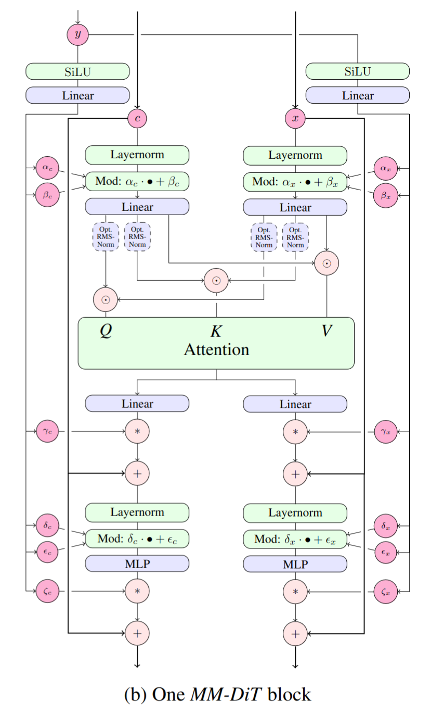

# MMDiT-PyTorch

**MMDiT-PyTorch** is a lightweight and standalone PyTorch implementation of a single block from the **Multimodal Diffusion Transformer (MMDiT)**, originally proposed in [*Scaling Rectified Flow Transformers for High-Resolution Image Synthesis*](https://arxiv.org/abs/2403.03206).



This project focuses on simplicity and minimal dependencies to allow easy understanding and extensibility for research and experimentation.

---

## 🔍 Overview

MMDiT introduces a scalable and efficient Transformer-based architecture tailored for high-resolution image synthesis through rectified flows. This repository implements a **single MMDiT block** for educational and experimental purposes.

- 📦 Single-block MMDiT in PyTorch
- 🧠 Minimal and readable implementation
- 🛠️ No training framework dependency

---

## 📦 Installation

Make sure you have Python 3.12+

### Using pip
```bash
pip install mmdit-pytorch
```

### From the source
```bash
git clone https://github.com/KennyStryker/mmdit-pytorch.git
cd mmdit-pytorch
poetry install
```

---

## 🚀 Usage

Make sure you have Python 3.12+ and [Poetry](https://python-poetry.org/) installed.

```python
from mmdit import MMDiTBlock
import torch

# Example input
x = torch.randn(1, 16, 768)  # (batch_size, sequence_length, dim)

# Initialize a single MMDiT block
block = MMDiTBlock(dim=768, num_heads=12)

# Forward pass
out = block(x)
print(out.shape)  # -> torch.Size([1, 16, 768])
```

---

## Citations

```bibtex
@article{arXiv,
    title   = {Scaling Rectified Flow Transformers for High-Resolution Image Synthesis},
    author  = {Patrick Esser, Sumith Kulal, Andreas Blattmann, Rahim Entezari, Jonas Müller, Harry Saini, Yam Levi, Dominik Lorenz, Axel Sauer, Frederic Boesel, Dustin Podell, Tim Dockhorn, Zion English, Kyle Lacey, Alex Goodwin, Yannik Marek, Robin Rombach},
    url     = {https://arxiv.org/abs/2403.03206}
}
```
